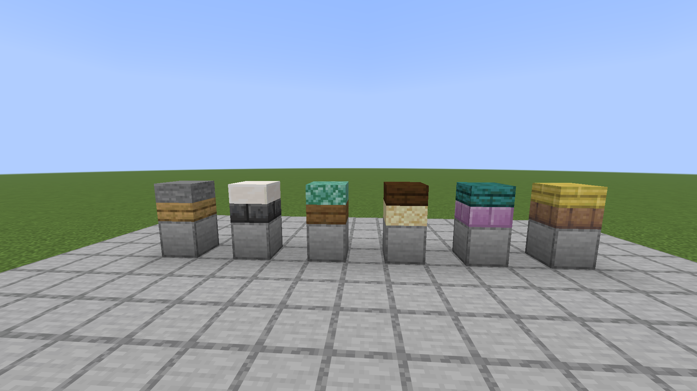

# Mixed Slabs

Two different slabs in one block space.

Server-side; Pandorical carries the client's half. Players need Pandorical and nothing else.

## Screenshots

## How

Place any slab onto any other slab's empty half. Vanilla does this already when both are the same
block and calls the result a double slab; when they differ it gives up and puts the new slab in the
next space along. This catches that second case and puts them in the same block.

Which half the new slab lands in is decided exactly the way vanilla decides it — from the face you
clicked and how high up you clicked it — so the two behave identically and the answer never depends
on which of them handled the click. Sneaking still means "ignore the block, use what is in my hand".

Break it and you get both slabs back, each as breaking that slab on its own would give it: a grass
slab half comes back as a dirt slab unless the tool has Silk Touch.

## Four blocks

There are four: `mixed_slab`, `mixed_dirt_slab`, `mixed_topper_slab` and `mixed_signal_slab`, split
by what is in the **top** half. That is not a stylistic division. A tag belongs to a block and not to
a state, so "this surface is dirt, plants may be placed on it" cannot be said about *some* states of
one block — splitting on the surface says it about all the states of one of them, and
`mixed_dirt_slab` sits in `#minecraft:dirt`. A thing resting on a slab is drawn where the lower half
ends rather than where the upper half begins, which is a different model for the same top half, so
it gets `mixed_topper_slab`; a redstone component carries an on/off bit the others have no use for,
so it gets `mixed_signal_slab`.

The four share every possible bottom half and divide the top halves between them, so together they
hold exactly the combinations a single block would. **The split costs no extra states at all.**

## Resting on a slab

Floor boards from [wood-floor](../wood-floor), torches, soul torches and carpets can be placed on a
slab and share its block instead of spending the one above. A torch on a slab gives off a torch's
light. Water can fill what a board or a carpet leaves empty; a torch on a slab is never waterlogged,
because water destroys one.

Hitting what stands on a slab — a torch, a lever, anything in this section or the next — knocks just
that off, at its own speed, and leaves the slab. It drops as it would anywhere else.

## Redstone on a step

Pressure plates, buttons, levers and redstone torches sit on a slab and share its block instead of
spending the one above. They work: a plate you stand on, a lever you flip, a button that springs
back, a torch that inverts what it is standing on.

**The components are not reimplemented.** Everything a signal is *read* through — whether the block
is a source, what it puts out and how strongly — is answered by building the real component's own
state and asking it, the same way hardness and sound already are. Only the *writing* is ours: when
the bit flips. That is a few lines per component rather than a system, and it is where the fidelity
comes from.

With [lever-torch](../lever-torch) and [player-detector](../player-detector) installed, a lever torch
and a player detector ride along the same way, and the detector still notices only players.

**One bit is the whole test.** A plate, a lever, a button and a torch each store a single boolean.
A repeater's delay, a comparator's mode, a weighted plate's sixteen power levels and redstone dust's
connection shape cannot be carried, and are not here.

**Candles ride along on the same terms.** A candle placed on a slab shares its block, and its one
bit is whether it is lit: flint and steel or a fire charge lights it, an empty hand puts it out, and
it gives off a lit candle's light. What it gives up is the count - vanilla stacks up to four in a
block, and there is no room here to say how many - so a candle on a slab is one candle, in any of
the seventeen colours. It cannot be waterlogged either; the block that carries a bit has no room for
water. And it does not flicker: the flame's dancing particle is a client-side animation tied to the
vanilla candle block, so a lit candle on a slab glows and lights the room, and holds still.

**Floor switches have no facing.** A lever powers the same whichever way it points, so facing is
cosmetic — and paying four times the states for it costs more than the orientation is worth.

## The rule

> A mixed slab is a full-height block whose surface material is its top half.

Ask it about material and it answers from a half. Nothing should read a slab type off one or offset
a plant onto one — a plant standing on a mixed slab stands at full height, which is why vanilla
plants are right for it and dirt-slab's half-height plant variants are not.

Its **shape** is whatever the two halves add up to. For two ordinary slabs that is a full cube. For a
fence post slab — which fills a half of the block but only a narrow post inside it — it is not, and
collision, culling and light all follow the real shape rather than a cube that isn't there.

## What other mods see

A mixed slab is its own block, so every "what block is this?" in the game sees a mixed slab and not
the two slabs inside it. `MixedSlabsApi` is how a mod finds out — a small static surface over plain
vanilla types, reached by reflection so nothing has to depend on this mod:

- `isMixedSlab(state)`
- `halves(state)` / `topHalf(state)` / `bottomHalf(state)`
- `withTopHalf(state, block)` — resurfacing, for grass creeping on or a shovel making a path. May
  hand back a state of the *other* block, since which one holds a combination depends on its top.

Wired up so far:

- **conductive-copper** — a cut copper slab inside a mixed slab still conducts. One copper half is
  enough: the metal is there, and asking for both would make a copper-and-oak step a wall the signal
  dies at.
- **dirt-slab** — grass spreads onto a mixed slab with dirt on top (only the top half changes, and
  only if it really is dirt); a shovel makes a path of the surface; a hoe loosens coarse dirt to
  dirt. Vanilla plants can be placed on any `mixed_dirt_slab`.

## Not covered

- **Grass on a mixed slab does not spread outward, and does not die in the dark.** Mixed slabs do
  not random-tick. Grass reaching one is a destination, not a source.
- **Snow does not whiten a grass surface** — there is no room for a `snowy` state.
- **Farmland cannot be mixed at all**, deliberately. Its behaviour lives in a moisture level a mixed
  slab has no room for, so one that looked like farmland could never be farmed; refusing is the
  honest answer.
- **Sneaking with a shovel does not halve one.** It is a full block; there is no half to take.

## How it works

A position holds one block state, and one block state cannot name two materials. So a mixed slab is
a block of its own whose state says which slab is in each half:

- **147 slabs**, vanilla plus the suite's own, and 93 things that rest on one: 42 boards, torches
  and carpets, and 51 redstone components and candles. That is 147 × 240 = 35,280 combinations,
  and 70,560 states across the four blocks, since each also carries one more bit (waterlogged, or
  on/off for the redstone one).
- The blockstates are **multipart**, which is what makes that tractable. Each half's model is
  selected by its own property independently, so each file needs one case per thing per half
  (two for a redstone component, on and off) — 879 across the four — rather than one per
  combination.
- The slab models are **vanilla's own**, or the sibling mod's. Only the vanilla things that rest on
  a slab get a model generated here, their own model lifted onto the halfway line. The geometry is
  not duplicated per state: a multipart state holds references to already-baked sub-models.

The win is that vanilla does the drawing. Lighting, ambient occlusion, face culling and break
particles are the real ones rather than an imitation, and there is no client-side rendering code to
go wrong. The cost is paid once at startup and never again per tick.

Everything the block does defers to whichever half is being asked about:

- **Hardness** is the harder half's, so pairing stone with oak is not a way to mine stone cheaply.
- **Drops** are judged per half — mixing stone into oak does not let you collect stone by hand, and
  does not cost you the oak for want of a pickaxe.
- **Sound** comes from the top half, the one you are standing on.

## Pandorical

Mixed Slabs registers the mixed slab block and its half-models through Pandorical's content sync,
and tints a grass half through Pandorical's block tints.

**The Pandorical mod must be installed client-side** to see a mixed slab drawn as its two halves.
Without it the mod still works server-side, but a connecting client sees an untextured block. Block
Tip, if installed, names both halves when you look at one.

## Development

Installing and the art pipeline are in [DEVELOPMENT.md](DEVELOPMENT.md).

## License

MIT, see [LICENSE](LICENSE).
